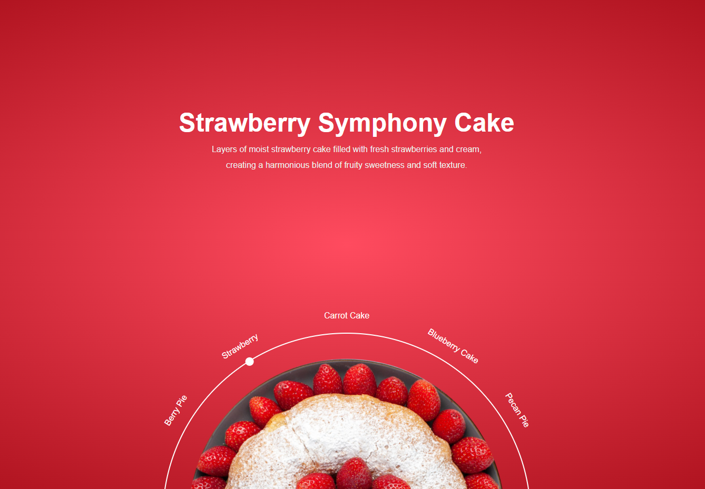

# SweetSpin – Interactive Menu 🍰

A beautiful and interactive circular menu landing page that showcases different desserts with delightful visuals and descriptions. Built using vanilla HTML, CSS, and JavaScript, this UI offers an engaging user experience ideal for bakery menus, café presentations, or food-related portfolios.

---

## ✨ Features

- 🍓 Smooth rotating dessert selector
- 📜 Dynamic description and image transition
- 🎨 Gradient-themed background per dessert
- 📱 Fully responsive for mobile and desktop
- ⚡ Lightweight and fast (No frameworks used)

---

## 🛠 Tech Stack

- **HTML5**
- **CSS3 (SCSS-style nesting)**
- **Vanilla JavaScript**

---

## 📸 Preview

---

## 🚀 Live Demo

[🔗 View Live Demo](https://ahmedragab15.github.io/SweetSpin-Interactive-Menu)